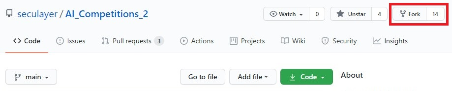
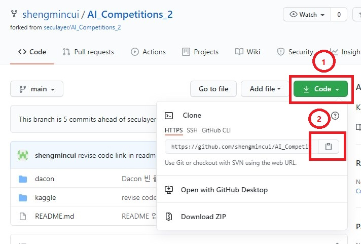

# Upload Kaggle Material (上传kaggle结果)


## 1. Download and Install Git (下载和安装Git)

### 1.1. Git download link (下载链接并按照提示安装): https://git-scm.com/

### 1.2. Add Git to System Environment Variables (配置git环境变量)

#### 1.2.1. Search "env " at task bar (在win10搜索框搜索关键字“env”或者“环境变量”)

</img>

#### 1.2.2. click Environment Variables button (点击环境变量按钮)

</img>

#### 1.2.3. click **Path** and edit (点系统变量中的Path然后点击编辑)

</img>

#### 1.2.4. click new (点新建，添加路径)

</img>

#### 1.2.5. add Git path (添加bin路径， 根据自己安装的路径进行添加，然后点击确定) 

</img>


## 2. Sign up GitHub (注册GitHub账号)

### 2.1. GitHub link (链接): https://github.com/


## 3. Fork the Project (从源项目派生一个完全属于自己的项目副本)

### 3.1. open link (用浏览器打开源项目链接): https://github.com/seculayer/AI_Competitions_2

### 3.2. click Fork button (点击Fork按钮):

<div align=left></div>

### 3.3. After Fork, enter your github page, as shown in the figure, the AI_Competitions_2 project appears in your repositories (Fork之后会进入自己的github仓库，如图，自己的仓库中出现了AI_Competitions_2的项目)

<div align=left></div>


## 4. Clone the Project (将派生的项目克隆到本地)

### 4.1. open cmd or terminal (打开命令提示符(windows)或者终端(mac or linux))

### 4.2. choose your dir to download the project (选择下载项目的路径)

```bash
cd yourdir
```

e.g. (例子)

<div align=left></div>

### 4.3. download the forked project (下载项目，链接如图所示，用浏览器打开自己的GitHub页面并选择派生的项目，然后点击Code按钮可以获得派生项目的URL， 然后在cmd或者终端输入下面的命令)

```bash
git clone URL(of your forked project)
```

<div align=left></div>

e.g. (例子)

<div align=left></div>

### 4.4. You can see that the AI_Competitions_2 folder has been downloaded to the local (AI_Competitions_2文件夹已经成功下载到本地)

<div align=left></div>


## Prepare your kaggle files


1. Put all the files that need to be submitted in a folder and name it the ID of the kaggle competition (Note: ID is not equal to the name of the competition, the ID can be found in the corresponding URL) (将需要提交的所有文件放在一个文件夹里，命名为kaggle比赛的ID(注意：ID不等于比赛名字，ID可以在对应URL中找到)

   

2. Put the entire folder in the downloaded AI_Competitions_2/kaggle (将整个文件放到下载的AI_Competitions_2/kaggle中)

   


## Submit Your Files (提交你的文件)

 1. Open cmd or terminal and enter the AI_Competitions_2 folder (进入终端，进入到AI_Competitions_2路径)

    

 2. Create a Branch (创建并进入一个分支)

    命令为 git checkout -b 分支名

    ```bash
    git checkout -b test
    ```

 3. Save your changes (保存修改)

    ```bash
    git add .
    ```

4. Commit our change to the branch (将修改内容提交到分支)

   ```bash
   git commit -m "Hanyang University Your name"
   ```

5. Push your branch to you GitHub fork (将分支推送到GitHub的副本中)

   ```bash
   git push origin test
   ```

6. When you push, you will be asked to type in your github information, just type it in as required (push的时候，会让你输入你的github信息，按要求输入即可)

7. Open your github web page and you will see the branch you created (用浏览器打开你的github页面，会看到你创建的分支)

   

## Pull Request

1. open your github link (用浏览器打开自己的GitHub上派生的项目页面): https://github.com/shengmincui/AI_Competitions_2
2. change your branch (选择你的分支， 如下图所示)
3. click Pull request button (点击Pull request 按钮， 如下图所示)


## Update from Forked Project (更新你派生的仓库)

1. Return to your branch (回到你设定的分支)

```bash
git checkout test
```

2. Fetch changes from forked project and merge them into your branch (从源仓库获取更改并且合并到你的分支)

```bash
git pull https://github.com/seculayer/AI_Competitions_2.git
```

3. Push your branch to origin (将你的分支推送到origin)

```bash
git push origin test
```


## Reference (参考)

[Seculayer AI_competitions_2](https://github.com/seculayer/AI_Competitions_2)

[Progit section 6.2 contributing to a Project (English)](https://git-scm.com/book/en/v2/GitHub-Contributing-to-a-Project)

[Progit section 6.2 contributing to a Project (Chinese)](https://git-scm.com/book/zh/v2/GitHub-%E5%AF%B9%E9%A1%B9%E7%9B%AE%E5%81%9A%E5%87%BA%E8%B4%A1%E7%8C%AE)
