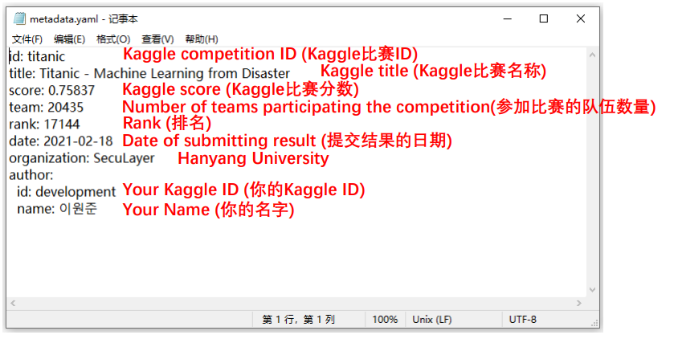

# Upload Kaggle Material (上传kaggle结果)


## 1. Download and Install Git (下载和安装Git)

### 1. 1. Git download link (下载链接并按照提示安装): https://git-scm.com/

### 1. 2. Add Git to System Environment Variables (配置git环境变量)

#### 1. 2. 1. Search "env " at task bar (在win10搜索框搜索关键字“env”或者“环境变量”)

</img>

#### 1. 2. 2. click Environment Variables button (点击环境变量按钮)

</img>

#### 1. 2. 3. click **Path** and edit (点系统变量中的Path然后点击编辑)

</img>

#### 1. 2. 4. click new (点新建，添加路径)

</img>

#### 1. 2. 5. add Git path (添加bin路径， 根据自己安装的路径进行添加，然后点击确定) 

</img>


## 2. Sign up GitHub (注册GitHub账号)

### 2. 1. GitHub link (链接): https://github.com/


## 3. Fork the Project (从源项目派生一个完全属于自己的项目副本)

### 3. 1. open link (用浏览器打开源项目链接): https://github.com/seculayer/AI_Competitions_2

### 3. 2. click Fork button (点击Fork按钮):

</img>

### 3. 3. After Fork, enter your github page, as shown in the figure, the AI_Competitions_2 project appears in your repositories (Fork之后会进入自己的github仓库，如图，自己的仓库中出现了AI_Competitions_2的项目)

</img>


## 4. Clone the Project (将派生的项目克隆到本地)

### 4. 1. open cmd or terminal (打开命令提示符(windows)或者终端(mac or linux))

### 4. 2. choose your dir to download the project (选择下载项目的路径)

```bash
cd yourdir
```

e.g. (例子)

</img>

### 4. 3. download the forked project (下载项目，链接如图所示，用浏览器打开自己的GitHub页面并选择派生的项目，然后点击Code按钮可以获得派生项目的URL， 然后在cmd或者终端输入下面的命令)

```bash
git clone URL(of your forked project)
```

</img>

e.g. (例子)

</img>

### 4. 4. You can see that the AI_Competitions_2 folder has been downloaded to the local (AI_Competitions_2文件夹已经成功下载到本地)

</img>


## 5. Prepare your kaggle files

The structure of the Kaggle folder is as follows (kaggle文件夹的结构如下):

```console
kaggle/
├── titanic/ # 예시 대회
│  ├── metadata.yaml
│  ├── README.md
│  └── *
└── {kaggle-competition-id}/
   ├── metadata.yaml
   ├── README.md
   └── *
```

### 5. 1. Create a new folder in the local "AI_Competitions_2/kaggle" folder, and use the Kaggle subject ID as the folder name (在本地的"AI_Competitions_2/kaggle"文件夹里面新建文件夹，并以Kaggle subject的ID作为文件夹名)

#### 5. 1. 1. Create new folder (新建文件夹)
</img>

#### 5. 1. 2. Get the ID of the kaggle subject  (获取kaggle比赛项目的ID)

The kaggle competition ID can be obtained from the competition URL.

e.g. If the URL of the competition is https://www.kaggle.com/c/Kannada-MNIST, the ID is Kannada-MNIST

### 5. 2. Prepare your files (准备你的文件，所需文件如下图所示)

</img>

#### 5. 2. 1. Prepare your screenshot and code (准备你的排名截图和代码)

</img>

#### 5. 2. 2. Edit "metadata.yaml" file (编辑metadata.yaml文件，可以从titanic文件夹里复制过来进行修改)

</img>

#### 5. 2. 3. Edit "README.me" file (编辑README.me文件，使用markdown语言，建议使用typora进行编辑)

</img>

Note: 

1. The syntax for adding an image is (在README.md里添加图片的语法是):

```markdown

```

2. The syntax for adding a hyperlink is (在README.md里添加超链接的语法是):

```markdown
[](./yourcodename)
```


## 6. Submit Your Files (提交你的文件)

### 6. 1. Open cmd or terminal and enter the AI_Competitions_2 folder (进入终端，进入到AI_Competitions_2路径)
</img>

### 6. 2. Setup your identity (设置你的身份)

```bash
git config --global user.name "your GitHub name"
git config --global user.email "your GitHub email"
```

### 6. 3. Adding files to the repository (将文件添加到版本库中)

```bash
git add .
```

### 6. 4. commit (提交改变)

```bash
git commit -m "Hanyang University Your Name"
```

### 6. 5. Push your commit to your GitHub fork (将提交的改变推送到自己forked的GitHub的副本中)

```bash
git push origin main
```

### 6. 6. Open your GitHub web page and you will see the changes you created (用浏览器打开你的github页面，会看到你修改的内容)

   

## 7. Pull Request

### 7. 1. open your GitHub link (用浏览器打开自己的GitHub上派生的项目页面): 
e.g.
https://github.com/shengmincui/AI_Competitions_2


### 7. 2. click Pull request button (点击Pull request 按钮， 如下图所示)


## 8. Update from Forked Project (更新你派生的仓库)

### 8. 1. Open cmd or terminal and enter the AI_Competitions_2 folder (进入终端，进入到AI_Competitions_2路径)
</img>


### 8. 2. Fetch changes from forked project and merge them into your branch (从源仓库获取更新改并且合并到你的本地仓库)

```bash
git pull https://github.com/seculayer/AI_Competitions_2.git
```

### 8. 3. Push your branch to origin (将你的本地修改推送到你的GitHub仓库)

```bash
git push origin main
```


## Reference (参考)

[Seculayer AI_competitions_2](https://github.com/seculayer/AI_Competitions_2)

[Progit section 6.2 contributing to a Project (English)](https://git-scm.com/book/en/v2/GitHub-Contributing-to-a-Project)

[Progit section 6.2 contributing to a Project (Chinese)](https://git-scm.com/book/zh/v2/GitHub-%E5%AF%B9%E9%A1%B9%E7%9B%AE%E5%81%9A%E5%87%BA%E8%B4%A1%E7%8C%AE)
